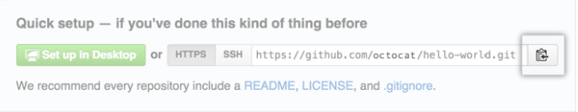

### Create a new repository on GitHub

[AlexandrSokolov's GitHub repositories](https://github.com/AlexandrSokolov?tab=repositories)

Note: To avoid errors, do not initialize the new repository with README, license, or gitignore files. 
You can add these files after your project has been pushed to GitHub.

### Initialize the local directory as a Git repository

Open Terminal (for Mac users) or the command prompt (for Windows and Linux users).

Change the current working directory to your local project.

Initialize the local directory as a Git repository:
```bash
git init
Initialized empty Git repository in ${somePath}/.git/
```

### Set your account’s defaults for this repository

Avoid setting global ones. As a developer you most probably work on different repositories with different accounts.

```bash
git config user.email "my.private.email@mail.com"
git config user.name "Alexandr"
```

If you still want to set your account's default identity common for all repositories use global option:
```bash
git config --global user.email "my.global.email@mail.com"
git config --global user.name "Alexandr"
```

### Add the files in your new local repository and commit them.

```bash
git add .
# Adds the files in the local repository and stages them for commit. To unstage a file, use 'git reset HEAD YOUR-FILE'.
```

### Set the repository remote url 

Copy the remote repository URL.

In GitHub via GUI add a new repository.

At the top of your GitHub repository's Quick Setup page, click  to copy the remote repository URL:



Set the new remote url and verify the new remote URL:

```bash
git remote add origin ${remote_repository_URL}
git remote -v
```

### Push the changes in your local repository to GitHub.
```bash
git push origin master
```


