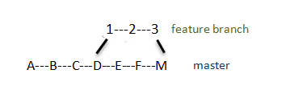

- [Merge branches](#merge-branchees)
- [Merge single commits](#merge-single-commits)

### Merge branchees

Assume we have 2 branches:

```bash
$ git branch -vv
  FROM_BRANCH a33b9e6 [origin/FROM_BRANCH] commit B, `FROM_BRANCH` branch
* TO_BRANCH   d2ef3e0 [origin/TO_BRANCH] commit C, `TO_BRANCH` branch
```

The commits history was:

In `TO_BRANCH` branch
1. `Initial commit` 
2. `git ignore added` 

`FROM_BRANCH` was copied from `TO_BRANCH` and then the commits in `FROM_BRANCH`:
3. commit A, `FROM_BRANCH` branch
4. commit B, `FROM_BRANCH` branch

The commit into `TO_BRANCH`, that is not known in `FROM_BRANCH` yet:
5. commit C, `TO_BRANCH` branch

Now we want to merge changes applied in `FROM_BRANCH` (commits #3 and #4) into `TO_BRANCH`

We have the following options:
- [Merge all commits from `FROM_BRANCH` into `TO_BRANCH`](#merge-all-commits-from-frombranch-into-tobranch)
- [Rebase `TO_BRANCH` from `FROM_BRANCH`](#rebase-tobranch-from-frombranch)
- [What’s the Difference Between Merge and Rebase?](#)

#### Merge all commits from `FROM_BRANCH` into `TO_BRANCH`

The history of all commits from `FROM_BRANCH` is saved in `TO_BRANCH`




1. Switch to the branch, that you want to update, in this case `TO_BRANCH`:
    ```bash
    $ git checkout TO_BRANCH
    ```
2. Merge all commits from `FROM_BRANCH` into `TO_BRANCH` without commit (`--no-commit`) 
   so that you can inspect the result of the merge before committing:
   ```bash
   $ git merge --no-commit FROM_BRANCH
   ```
3. Resolve conflicts.
4. Commit changes in the `TO_BRANCH` for instance with message: 
    `Merge branch 'FROM_BRANCH' into TO_BRANCH`
5. Commits history:
   ```bash
   $ git log --oneline
   eea354d (HEAD -> TO_BRANCH) Merge branch 'FROM_BRANCH' into TO_BRANCH
   d2ef3e0 (origin/TO_BRANCH) commit C, `TO_BRANCH` branch
   a33b9e6 (origin/FROM_BRANCH, FROM_BRANCH) commit B, `FROM_BRANCH` branch
   aa53980 commit A, `FROM_BRANCH` branch
   2f732c1 git ignore added
   d64c99c Initial commit
   ```
   As we see commits #3, #4 are part of the history, as well as a merge commit.

#### Rebase `TO_BRANCH` from `FROM_BRANCH`

This effectively looks as if `TO_BRANCH` was branched from `FROM_BRANCH` (after commits #3 and #4)


1. Switch to the branch, that you want to update, in this case `TO_BRANCH`:
    ```bash
    $ git checkout TO_BRANCH
    ```
2. Rebase `TO_BRANCH` by `FROM_BRANCH`
    This effectively looks as if `TO_BRANCH` was branched from `FROM_BRANCH` (after commits #3 and #4)
   ```bash
   $ git rebase FROM_BRANCH
   ```
3. Resolve conflicts.
4. Commits history:
   ```bash
   $ git log --oneline
   51ab4e9 (HEAD -> TO_BRANCH) commit C, `TO_BRANCH` branch
   a33b9e6 (origin/FROM_BRANCH, FROM_BRANCH) commit B, `FROM_BRANCH` branch
   aa53980 commit A, `FROM_BRANCH` branch
   2f732c1 git ignore added
   d64c99c Initial commit
   ```

#### What’s the Difference Between Merge and Rebase?

The main difference between git merge and git rebase is that 
git merge is a way of combining changes from one branch (source branch) into another branch (target branch) 
where as git rebase is a way of moving the changes from one branch onto another branch.

- Merge preserves history in chronological order.
- Merge creates a complete log that helps developers understand the big picture, showing when and how each merge occurred
- Merge’s exhaustive nature results in a clumsy history and log

- Rebase rewrites history (streamlines a possibly complex history, linear log)
- Rebase avoids the merge commit noise typically found in busy repos and busy branches
- Users can’t track how and when commits were merged on the target branch
- Rebase makes you resolve conflicts in the order they were created to continue the rebase. Unfortunately,
  this means more work for you, as you may need to fix the same conflicts repeatedly

What matters more to your team? 

Is it **the simplicity of rebasing** or **the history and traceability of merging**? 
An effective merging strategy relies on comparing team needs against available resources.

It’s possible to use both Git rebase and Git merge in the same project. 
For example, you can work on a feature branch, create another feature branch off it, make your changes, 
and finalize them as commits. 
You could then Git merge both feature branches, then use a Git rebase to merge the feature branches into the main branch. 
This way, you, as the developer, can do you work on a feature branch, 
but other team members won’t see it when they look at the main branch.

Put another way; you can use Git rebase to work on a private branch, then do Git merge to bring everything together 
into one coherent timeline.

### Merge single commits

TODO:
[Cherry-pick separate commits](https://www.jetbrains.com/help/webstorm/apply-changes-from-one-branch-to-another.html#cherry-pick)
